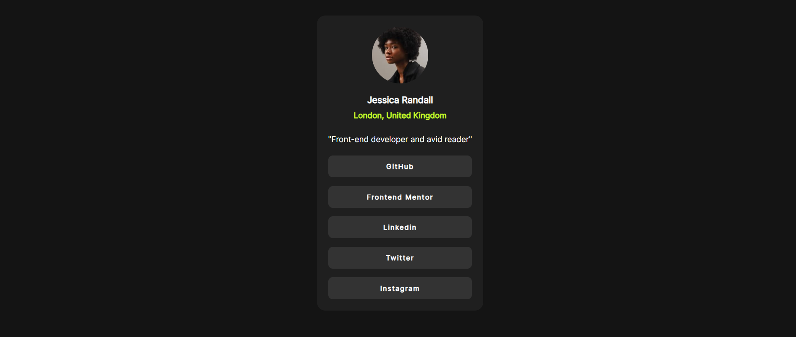
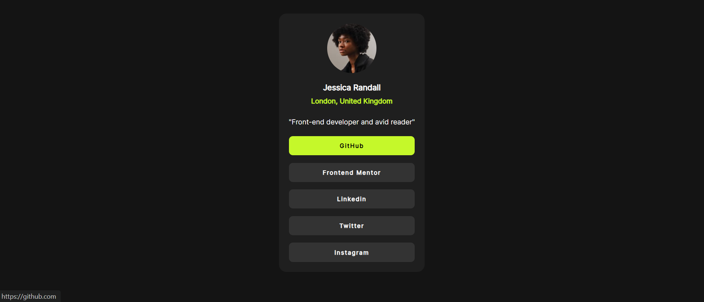

# Frontend Mentor - Social links profile solution

This is a solution to the [Social links profile challenge on Frontend Mentor](https://www.frontendmentor.io/challenges/social-links-profile-UG32l9m6dQ). Frontend Mentor challenges help you improve your coding skills by building realistic projects.

## Table of contents

- [Overview](#overview)
  - [The challenge](#the-challenge)
  - [Screenshot](#screenshot)
  - [Links](#links)
- [My process](#my-process)
  - [Built with](#built-with)
  - [What I learned](#what-i-learned)
  - [Continued development](#continued-development)
- [Author](#author)
- [Acknowledgments](#acknowledgments)

## Overview

### The challenge

Users should be able to:

- See hover and focus states for all interactive elements on the page

### Screenshot

Below is a preview of my final implementation of the Social Links Profile challenge. The layout is centered on the screen and styled to closely match the provided design, including hover states for all interactive link buttons.

The design adapts properly to different screen sizes while maintaining visual hierarchy and spacing consistency.

### Links

- Solution URL: [GitHub](https://github.com/yomidev/social-links)
- Live Site URL: [GitHub Pages](https://yomidev.github.io/social-links/)

## My process

### Built with

- Semantic HTML5 markup
- Custom fonts using @font-face
- CSS Flexbox
- Responsive layout techniques
- Hover state styling

### What I learned

While working on this project, I reinforced my understanding of layout alignment using Flexbox. Centering the card both vertically and horizontally helped me better understand how display: flex, justify-content, and align-items work together.

I also practiced building reusable button-style links using anchor tags. Styling interactive elements with hover states improved the overall user experience and helped me focus on visual feedback.

Additionally, I strengthened my skills in managing spacing, typography, and color contrast to closely match the original design. Working with custom fonts using @font-face also helped me understand how to integrate local font files properly.

### Continued development

In future projects, I would like to:

- Improve accessibility by enhancing focus states for keyboard navigation.
- Refine responsive design techniques for more complex layouts.
- Explore CSS transitions and animations to create smoother interactive effects.
- Continue improving visual consistency and component reusability.

## Author

- Website - [Yomira Martínez](https://github.com/yomidev)
- Frontend Mentor - [@yomidev](https://www.frontendmentor.io/profile/yomidev)
- Twitter - [@yomimsm](https://x.com/yomimsm)

## Acknowledgments

Thanks to Frontend Mentor for creating this challenge and providing an excellent opportunity to practice frontend development skills.
